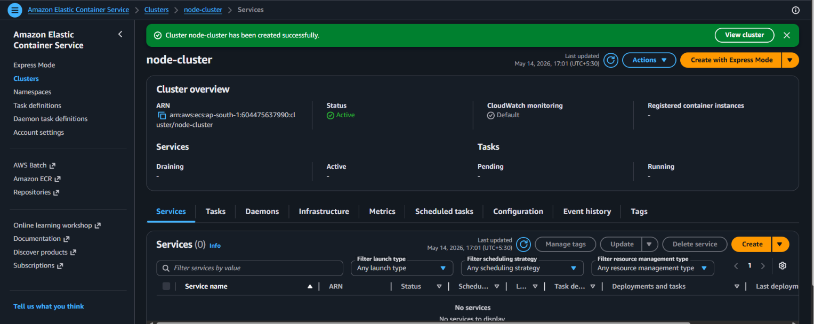
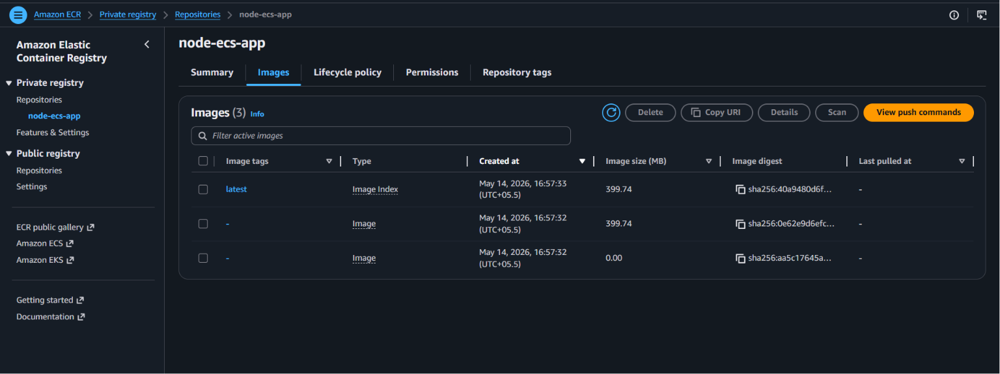

# Containerized-Node.js-Application
Built and deployed a Docker-based Node.js application using Amazon ECR and ECS for containerized application management.

🎯 **Purpose**
Deploy and run a Node.js application using Docker containers for scalable and efficient application management.

🧰 **AWS Services**
* Amazon Elastic Container Registry (ECR)
* Amazon Elastic Container Service (ECS)

⚙️ **Workflow**
1. Create Node.js application
2. Create Dockerfile
3. Build Docker image
4. Push image to ECR
5. Create ECS Cluster
6. Create Task Definition
7. Create ECS Service
8. Deploy application
9. Access running application through public endpoint

📌 **Outcome**
Containerized deployment with automated scaling and simplified application management using AWS container services.

## 📸 Project Screenshots

### 1. Docker Ignore Configuration
This shows the Docker ignore file configuration.
[View .dockerignore](.dockerignore)

### 2. Amazon ECS Cluster
This shows the ECS cluster running the Node.js container.

### 3. Docker Desktop
This shows Docker image build and container setup.

### 4. Dockerfile in VS Code
This shows the Dockerfile configuration in VS Code.

### 5. Node.js Application Output
This shows the Node.js application running in the browser.
.png)

### 6. Amazon ECR Repository
This shows the Docker image repository stored in Amazon ECR.

## 📂 Project Files

### Node.js Application
[View app.js](app.js)

### Package Configuration
[View package.json](package.json)

### Package Lock File
[View package-lock.json](package-lock.json)

### Docker Configuration
[View Dockerfile](Dockerfile)
